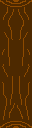
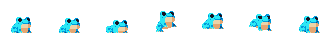
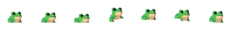
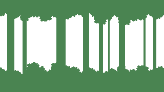
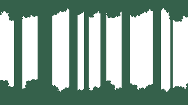
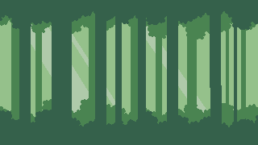

# Flok

## Description
**Flok** Today I bring you a FlappyFrog called Flok, in this adventure you will be a frog that must dodge the logs that are crossing your path, avoid them as you can!

## Made With
- **Raylib**: Main library used for the development of the game.

## How To Download
1. Download Flok_1.0.zip
2. Right click “extract all” or “extract here”
3. Open folder "Flok_1.0"
4. Run Flok.exe | This version is x86
5. For the Project you must have it on x86

## Sprites
<!-- Aquí puedes agregar capturas de pantalla o GIFs del juego -->

## Credits

**Lead Developer**  
[Nicolas Gallardo](https://projectbifron.itch.io/)

**Developer**  
[Emanuel Parajon](https://frostpower.itch.io)

**Art**  
[Emanuel Parajon](https://frostpower.itch.io)
  1. [Piskel](https://www.piskelapp.com/)

[Eduardo Scarpato](https://eduardscarpato.itch.io/):
  1. [Toxic Frog](https://eduardscarpato.itch.io/toxic-frog-animations-pixel-art-2d-free)
  2. [Forest Tileset](https://eduardscarpato.itch.io/forest)

**Sounds**  
[ChipTone](https://sfbgames.itch.io/chiptone)

**Music**  
[CalvinClavier](https://pixabay.com/es/users/calvinclavier-16027823/)
  1. [Menu](https://pixabay.com/es/music/clasico-moderno-relaxing-piano-music-259727/)
  2. [GamePlay](https://pixabay.com/es/music/clasico-moderno-relaxing-piano-music-255028/)

**Special Mentions**  
Sergio Baretto  
Stefano Cvitanich  
Nicolas Gallardo
and you for playing!

## About Me
I'm a first year student at image campus in the videogame development technicature. And I love videogames!
[#imagecampus](https://www.imagecampus.edu.ar/)

## Links
[My Itch.io](https://frostpower.itch.io). 

[Game Itch.io](https://frostpower.itch.io/capsule-reaper). 

## Licence
This project does not have a specific license. All rights reserved.
